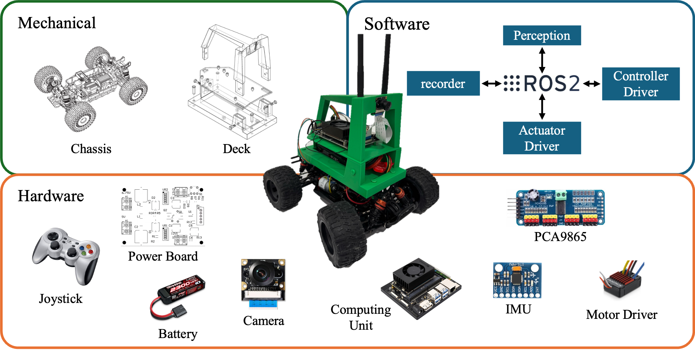

# TEACar
## Introduction
**TEACAR** is a 1/14- to 1/16-scale autonomous racing platform explicitly designed around modularity and hardware abstraction. The platform is intended to support a wide range of experimental configurations. At the mechanical level, the platform adopts a four-layer deck architecture that physically decouples key subsystems, improving mechanical stability while simplifying assembly and component replacement. On the software side, the platform offers a standardized, extensible middleware layer
for sensing, communication, and control via the Robot Operating System (ROS) 2 [10]. The hardware ensures safe and reliable system operation with a dedicated power distribution board, designed to support onboard components with varying voltage requirements.



### Project layout
```
deck        # STL files for 3D printed parts
powerboard  # Manufacturing files for the power board 
software    # ROS2 package for the TEACar
```

### Build Your Car

#### 1️⃣ Purchase Required Components

- PCA9685 PWM driver board  
- NVIDIA Jetson Orin Development Kit  
- A 1/14- or 1/16-scale RC car chassis  
- Follow the [Power Board Guide](./powerboard/README.md) to order the custom power board and required materials  
- Joystick (recommended: Logitech F710)  
- Camera (optional, for vision-based tasks)

---

#### 2️⃣ Prepare the Mechanical Structure

- Follow the [Deck Guide](./deck/README.md) to print and assemble the deck components  
- Design and 3D print the interface layer between the deck and your selected RC chassis  

---

#### 3️⃣ Assemble the Hardware
- Solder and assemble the power board according to the power board documentation  
- Mount the Jetson board, PCA9685 module, and power board onto the deck using appropriate bolts and standoffs  
- Secure the battery and ensure proper cable management  
- Connect components using Dupont cables or appropriate connectors  
- Double-check wiring and verify correct voltage levels before powering on  

---

#### 4️⃣ Install, Power On, and Configure Software

- Follow the [Software Setup Guide](./software/README.md) to install dependencies and build the project  
- Power on the system  
- Verify that the Jetson boots correctly  
- Confirm that all hardware devices (PWM board, joystick, camera) are detected  
- Configure parameters for your specific chassis and hardware setup  

---

#### 5️⃣ Drive the Car

- Connect the joystick  
- Launch the control stack  
- Test steering and throttle response  
- Begin manual driving