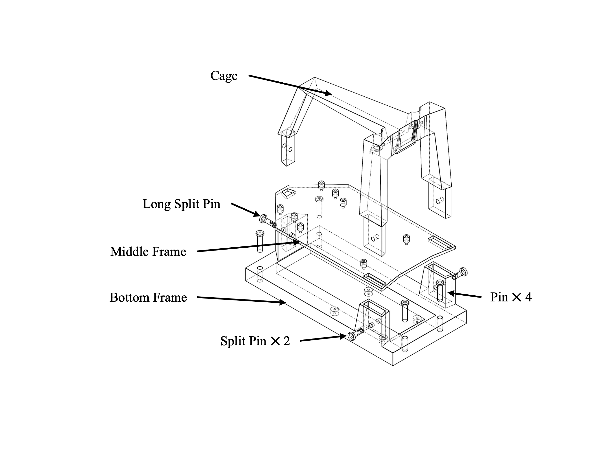

## Build the deck

### Print parts
You need a 3d printer to print stl files under the `CAM` folder. The required quantity of each printed component is listed in the table below.

| Part Name              | File Name            | Quantity | Material (Recommended) |
|------------------------|----------------------|----------|------------------------|
| Cage                   | Cage.STL             | 1        | PLA                    |
| Middle Frame           | Middle_Frame.STL     | 1        | PLA                    | 
| Bottom Frame           | Bottom_Frame.STL     | 1        | PLA                    |
| Split Pin              | Split_Pin.STL        | 2        | PLA                    | 
| Long Split Pin         | Long_Split_Pin.STL   | 1        | PLA                    |
| Pin                    | Pin.STL              | 4        | PLA                    | 

### Assemble the deck
Follow the image to assemble the deck

